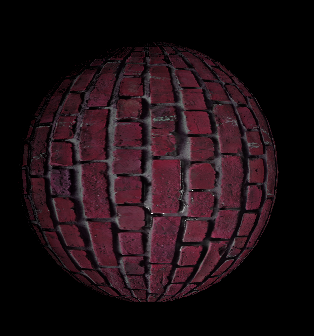

# Tortuga

Tortua is an open source game engine built using C# dot net core 3.0




## Core Features

- Multi-Threaded Rendering
- Entity Component System (With Component Behaviour)
- PBR Shader (Metalness Workflow)
- Event Based Input System
- Material JSON Object
- Material Instancing
- Full Linux Support

## Prerequisites

- Dot Net Core 3.0
- Vulkan
- SDL (With Vulkan Support)

## How to Run

1. `dotnet restore tortuga.sln`
2. `dotnet build tortuga.sln`
3. `./Tortuga.Test/bin/Debug/netcoreapp3.0/Tortuga.Test.dll`

## Example

#### Sample Code:
```c#
//create new scene
var scene = new Core.Scene();

//camera
{
    var entity = new Core.Entity();
    var camera = await entity.AddComponent<Components.Camera>();
    camera.FieldOfView = 90;
    scene.AddEntity(entity);
}

//load obj model
var sphereOBJ = await Graphics.Mesh.Load("Assets/Models/Sphere.obj");
//load bricks material
var bricksMaterial = await Graphics.Material.Load("Assets/Material/Bricks.json");

//light
{
    var entity = new Core.Entity();
    var transform = await entity.AddComponent<Components.Transform>();
    transform.Position = new Vector3(0, 0, -7);
    transform.IsStatic = true;
    //add light component
    var light = await entity.AddComponent<Components.Light>();
    light.Intensity = 200.0f;
    light.Type = Components.Light.LightType.Point;
    light.Color = System.Drawing.Color.White;
    scene.AddEntity(entity);
}

//sphere 1
{
    var entity = new Core.Entity();
    var transform = await entity.AddComponent<Components.Transform>();
    transform.Position = new Vector3(0, 0, -10);
    transform.IsStatic = false;
    //add mesh component
    var mesh = await entity.AddComponent<Components.RenderMesh>();
    mesh.Material = bricksMaterial;
    await mesh.SetMesh(sphereOBJ); //this operation is async and might not be done instantly

    scene.AddEntity(entity);
}

//sphere 2
{
    var entity = new Core.Entity();
    var transform = await entity.AddComponent<Components.Transform>();
    transform.Position = new Vector3(3, 0, -10);
    transform.IsStatic = false;
    //add mesh component
    var mesh = await entity.AddComponent<Components.RenderMesh>();
    mesh.Material = bricksMaterial;
    await mesh.SetMesh(sphereOBJ); //this operation is async and might not be done instantly

    scene.AddEntity(entity);
}
var block = new Graphics.UI.UiRenderable();
block.PositionXConstraint = new Graphics.UI.PercentConstraint(1.0f) - new Graphics.UI.PixelConstraint(310.0f);
block.PositionYConstraint = new Graphics.UI.PixelConstraint(10.0f);
block.ScaleXConstraint = new Graphics.UI.PixelConstraint(300.0f);
block.ScaleYConstraint = new Graphics.UI.PercentConstraint(1.0f) - new Graphics.UI.PixelConstraint(20.0f);
block.BorderRadius = 20;
block.Background = System.Drawing.Color.FromArgb(200, 5, 5, 5);
scene.AddUserInterface(block);

//add systems to the scene
scene.AddSystem<Systems.RenderingSystem>();
scene.AddSystem<AutoRotator>();
scene.AddSystem<LightMovement>();

Engine.Instance.LoadScene(scene); //set this scene as currently active
await Engine.Instance.Run();
```

#### Material JSON
```json
{
  "Type": "Material",
  "IsInstanced": false,
  "Shaders": {
    "Vertex": "Assets/Shaders/Default/Default.vert",
    "Fragment": "Assets/Shaders/Default/Default.frag"
  },
  "DescriptorSets": [
    {
      "Type": "UniformData",
      "Name": "LIGHT"
    },
    {
      "Type": "UniformData",
      "Name": "Data",
      "Bindings": [
        {
          "Values": [
            {
              "Type": "Int",
              "Value": 0
            }
          ]
        }
      ]
    },
    {
      "Type": "SampledImage2D",
      "Name": "Textures",
      "Bindings": [
        {
          "Image": "Assets/Images/Bricks/Albedo.jpg",
          "MipLevel": 1
        },
        {
          "Image": "Assets/Images/Bricks/Normal.jpg",
          "MipLevel": 1
        },
        {
          "BuildImage": {
            "R": "Assets/Images/Bricks/Metalness.jpg",
            "G": "Assets/Images/Bricks/Roughness.jpg",
            "B": "Assets/Images/Bricks/AmbientOclusion.jpg"
          },
          "MipLevel": 1
        }
      ]
    }
  ]
}
```
